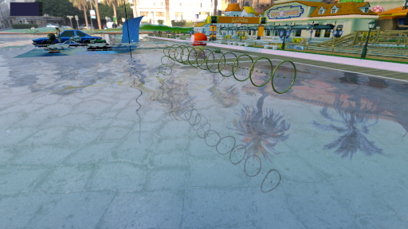

# Prompt‑Driven Scene Authoring in Lucre

   

This document describes a **prompt‑engineered workflow** for generating procedural scenes in **Lucre** using:
- an **Asset Catalog**
- a **Scene Description** (Lucre runtime format)
- natural‑language prompts as the authoring interface

The example showcased here produces a curved 3D path visualized with **rings** and **stubs**, fully generated from prompts and compiled into a valid Lucre scene description [Lucre scene description](https://github.com/beaumanvienna/vulkan/blob/master/application/lucre/sceneDescriptions/lucreSceneDescriptionSpec.md)

---

## 1. Overview

The workflow consists of three conceptual layers:

1. **Geometry Assets**  
   Authored externally (e.g. Blender) and exported as `.glb`.

2. **Asset Catalog (tooling‑side)**  
   Declares *what assets exist*, their semantic meaning, and placement conventions.

3. **Scene Description (runtime)**  
   A concrete, fully expanded [Lucre Scene Description JSON](https://github.com/beaumanvienna/vulkan/blob/master/application/lucre/sceneDescriptions/lucreSceneDescriptionSpec.md) consumed directly by the engine.

Natural‑language prompts are used to *generate* steps (2) and (3).

---

## 2. Asset Authoring

### 2.1 Ring Asset

- Shape: ring
- Diameter: **1 m**
- Plane: **x–y**
- Up axis: **+Y**
- Orientation: upright

**Source file**
```
application/lucre/sceneDescriptions/auto-generated/ring.glb
```

### 2.2 Stub Asset

- Shape: cylinder
- Diameter: **0.05 m**
- Height: **0.05 m**
- Circular head ends in **x–y plane**
- Symmetry axis: **z**
- Orientation: lying

**Source file**
```
application/lucre/sceneDescriptions/auto-generated/stub.glb
```

---

## 3. Prompts Used

### 3.1 Ring Asset Catalog Prompt

> Attached is a model of a ring.  
> Its diameter is **1 m**.  
> It lies in the **x–y plane**.  
> **Y is up**.  
> The image shows the ring in an upright position.  
>  
> Issue an **Asset Catalog file** according to the attached **Lucre Scene Authoring Spec**.  
>  
> To load the file, use:  
> `application/lucre/sceneDescriptions/auto-generated/ring.glb`  
>  
> The internal asset name shall be:  
> **`ring_1m_gold`**.

### 3.2 Stub Asset Catalog Prompt

> Attached is a model of a cylinder.  
> Its diameter is **0.05 m**.  
> Its height is **0.05 m**.  
>  
> Its circular head ends lie in the **x–y plane**.  
> **Y is up**.  
>  
> The image shows the cylinder in a **lying position**, with its symmetry axis aligned to the **z axis**.  
>  
> Issue an **Asset Catalog file** according to the attached **Lucre Scene Authoring Spec**.  
>  
> To load the file, use:  
> `application/lucre/sceneDescriptions/auto-generated/stub.glb`  
>  
> The internal asset name shall be:  
> **`stub_0_05m_gold`**.

---

## 4. Scene Generation Prompt

> Create a **scene description** according to the attached **Lucre Scene Description file format specification**.
>
> Create a path that starts at the **origin** and is henceforth called **`p1`**.
>
> Path **p1**:
> - starts horizontally along the **+X direction** for **10 m**
> - then bends **upward by 45 degrees**
> - continues until it reaches a **height of 5 m**
> - then bends **downward by 45 degrees** to become horizontal again
> - continues horizontally for **10 m** and ends there
>
> Place **rings** along the path at **1 m spacing**, such that the **ring’s center normal points along the local path direction**.
>
> Place many **stubs** along the same path to visualize its shape.

---

## 5. Result

The generated scene:

- Contains **procedurally placed ring instances** aligned to the path tangent
- Uses **dense stub placement** to visualize curvature and elevation changes
- Is fully expanded into a **standard [Lucre Scene Description JSON](https://github.com/beaumanvienna/vulkan/blob/master/application/lucre/sceneDescriptions/lucreSceneDescriptionSpec.md)**
- Loads directly in the Lucre engine without any runtime changes

This confirms that:

✅ Prompt‑engineered procedural scene authoring works  
✅ Asset catalogs provide the missing semantic layer  
✅ Scene descriptions remain low‑level and deterministic  

---

## 6. Why This Matters

This approach enables:

- Rapid level prototyping
- Author‑friendly scene design
- Deterministic, version‑controllable output
- A clean separation between **intent** and **runtime representation**

It is a strong foundation for future tooling such as:
- spline paths
- parametric geometry
- rule‑based layout systems
- AI‑assisted level design

---

**Status:** validated in-engine  

